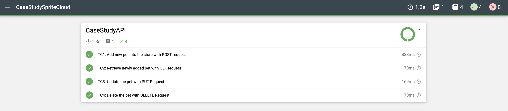
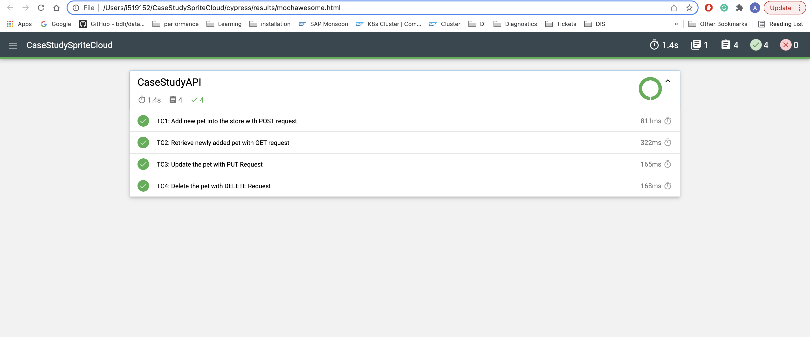

# SpriteCloud Case Study
The test cases in the case study was automated by using Cypress.io test automation tool. 

In order to run the tests, node.js and cypress.io must be installed as prerequisites

- Please refer [Node.js](https://nodejs.org/en/download/) installation
- Please refer [Cypress.io](https://docs.cypress.io/guides/getting-started/installing-cypress) installation

## Setup

After cloning the project following setup step must be performed.

```bash
npm install
```

## Structure

- There are two spec.js files under the cypress/integration/suite folder;
- **apiQuestion.spec.js:** It runs following API tests in the https://petstore.swagger.io/ (data parameters can be found inside the cypress/fixtures/testDataAPI.json file)
    - TC1: Add new pet into the store with POST request (it is adding new pet to the store by giving "id" and "name")
    - TC2: Retrieve newly added pet with GET request (it is retrieving the newly added pet)
    - TC3: Update the pet with PUT Request (It is updating the pets name)
    - TC4: Delete the pet with DELETE Request (It is deleting the pet as a final step)
- **uiQuestion.spec.js:** It runs the following UI tests in the https://demoqa.com/ (data parameters can be found inside the cypress/fixtures/testData.json file)
    - TC1: Submit Text Box Form (user navigates to the https://demoqa.com/text-box page and filling out the form)
    - TC2: Check whether user can search and select the book (user navigates to the https://demoqa.com/books page, then search and open the book)
    - TC3: Check whether user can fill the student registration form (user navigates to the https://demoqa.com/automation-practice-form page and filling out the form)

- There are two .js file under the cypress/support/pageObject folder
    - **ElementsPage.js**
    - **HomePage.js** 

## Run and Generate Test Report
### Run Via Terminal

Please execute following command in order to run the tests;

```bash
npx cypress run --spec cypress/integration/suite/apiQuestion.spec.js
npx cypress run --spec cypress/integration/suite/uiQuestion.spec.js
```

A cypress report will appear at the end of the execution. In addition to that you can find the html and json report under the cypress/results folder (I used "mochawesome" to do that)

- Sample mochawesome report



Also, there is a main.yaml file under the .github folder, thanks to this file after each new "git push", tests run automatically in the github actions 
and test report file can be seen in the Calliope.pro at the end of the execution.

- Sample calliope report https://app.calliope.pro/reports/115581



### Run Via Cypress Interface

Please execute following command in order to start cypress interface in the terminal;

```bash
npx cypress open    
```

Afterwards you can select any spec.js files under suite folder in order to run


